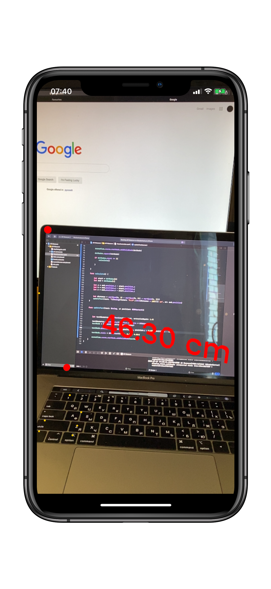

# AR Measure
This is an Augmented reality app that measures the distance between two points in space and shows the distance on the screen

# Technologies used
- Xcode
- Swift
- UIKit
- ARKti
- SceneKit

# Screenshots

